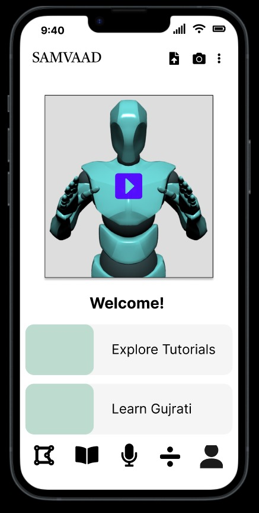

# Gujarati-Sign-Language

## Samvaad (Team: entropy)

**Samvaad** is a React Native-based application that integrates with various microservices to perform tasks based on the specified problem statement. The flowchart above illustrates the application's overall workflow. The UI of the application can also be seen as:

    
    

## Below, you can find the working details of some of the key `models`:

### Canvas based Gujarati Character Recognition Model

The given model takes input from the canvas and runs the inference on the model to know about which Gujarati character the given image is.

### Text to Sign Model 

The below output shows the speech to ISL sign conversion using Gujarati speech as input and rendering the model:

    
    

As the input for particular Gujarati speech is received, it's then transcribed to Gujarati and then converted to English text to be further rendered by the model.

